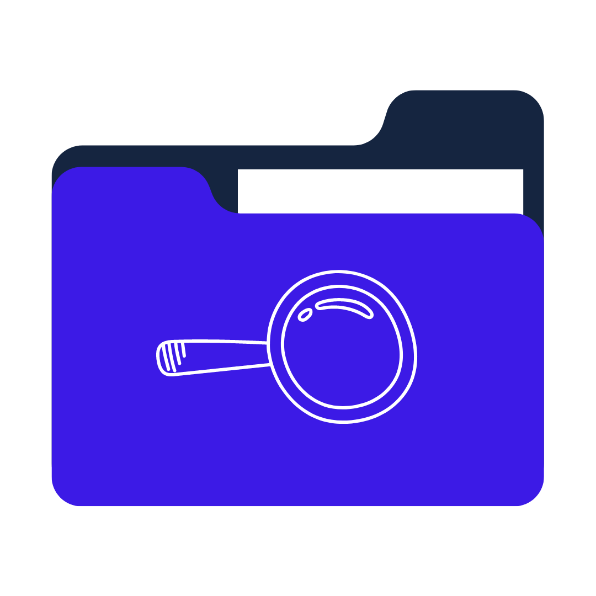
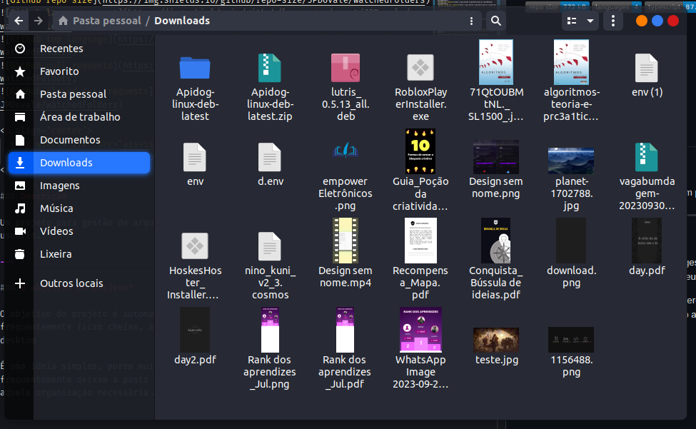

  
  <h1 align="center">watchedFolders</h1>

### Descrição

Um projeto para gestão de arquivos em pastas que podem ser selecionadas pelo usuário.

---

### O objetivo do projeto?

O objetivo do projeto é automatizar a gestão de arquivos em pastas que frequentemente ficam cheias, auxiliando assim na organização do usuário no seu desktop

É uma ideia simples, porem muito poderosa para aqueles esquecidos que frequentemente deixam a pasta downloads cheia de arquivos e ficam postergando aquela organização necessária... Esse é o meu caso.

  

Há uma grande possibilidade da sua pastinha ai ter uma infinidade de coisas a mais que a minha, uma vez que é muito comum baixarmos coisas com muita frequência na internet.

E se pudéssemos arrumar tudo isso com apenas um clique... Ou até melhor, sem a necessidade de clicar em nada, deixar que o próprio app faça a transferência do seu download para uma outra pasta?

É exatamente isso que queremos!

---

### Como contribuir com o projeto?

É muito simple!

Basta criar um fork desse repositório para o seu GitHub, fazer o clone na sua maquina e criar uma branch com o seu nome.

`npm install` para instalar as dependências do projeto.

`npm start` para iniciar o projeto na sua maquina.

Com o ambiente pronto, você pode começar a contribuir.

Após todas as alterações, é só abrir um pr solicitando a inclusão do seu código ao repositório principal. Lembre-se de manter os commits semânticos e um código organizado.
